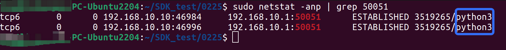
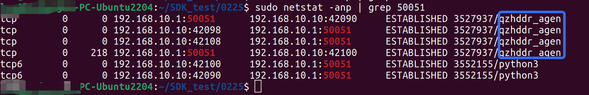
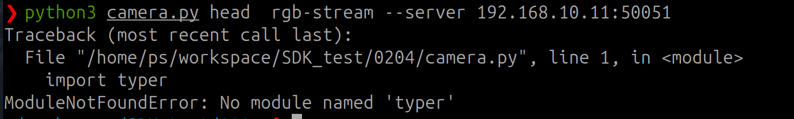
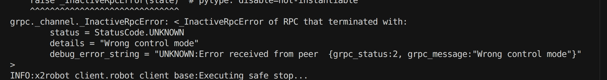
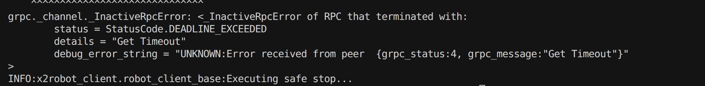
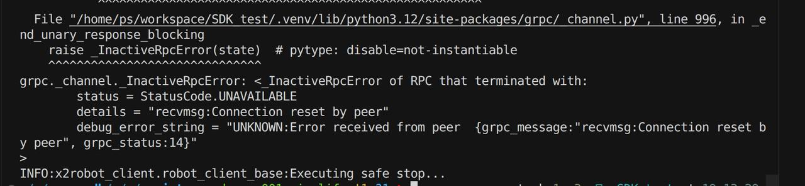
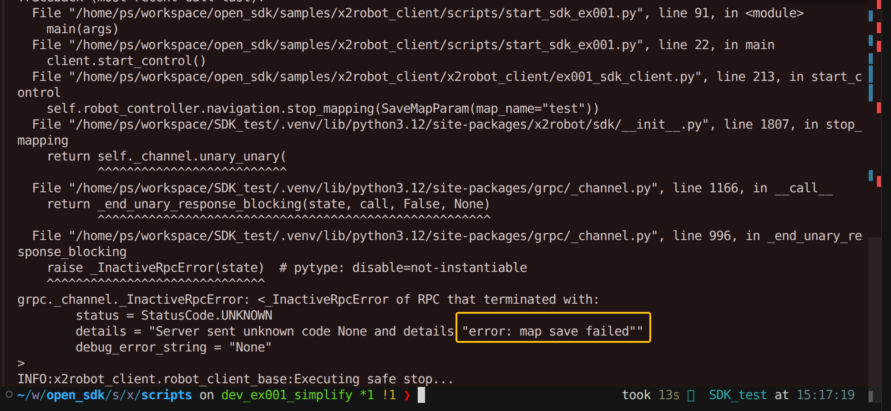
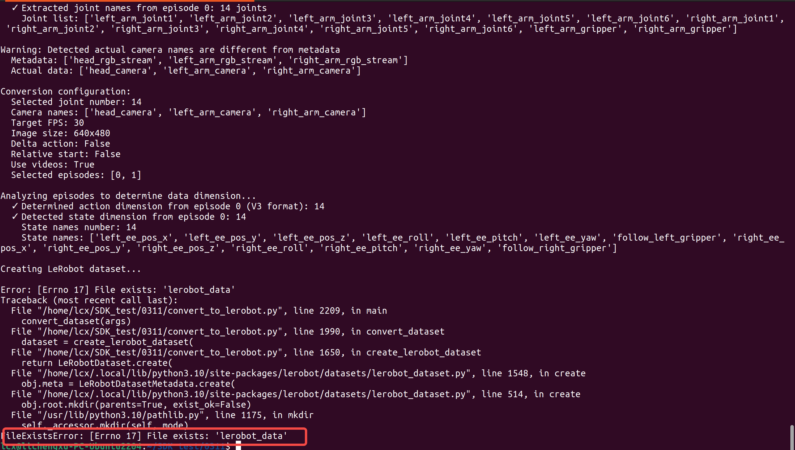
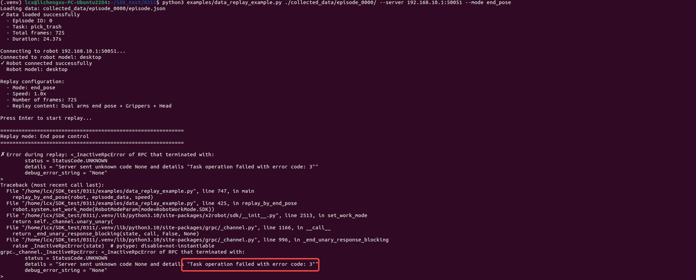

# X2Robot SDK

<div align="left">
  
</div>

**Language / 语言**: [English](README.md) • [中文](README_CN.md)

## Introduction

X2Robot SDK provides Python libraries for controlling X2 robots.

## System Requirements

### Hardware Requirements

- CPU: Intel i5 or equivalent performance
- Memory: 8GB or more
- Storage: 100GB available space
- Network: Stable network connection

### Software Requirements

| Component | Version Requirement | Description |
|-----------|---------------------|-------------|
| Operating System | Ubuntu 22.04/24.04 (x86_64) | LTS versions recommended |
| Python | 3.10+ | SDK development language |

## Getting Started

### Environment Setup

For Ubuntu and Python installation instructions, please refer to:

- Ubuntu 22.04 LTS installation: [Official Ubuntu Installation Guide](https://ubuntu.com/download)
- Python: [Python Official Website](https://www.python.org/)

## Network Configuration

1. Connect your PC to the robot using a USB-to-Ethernet adapter module and an Ethernet cable

2. Configure Your PC's LAN IP:

   - Open PC Settings → Network → Wired configuration
   - Set IP to manual configuration
   - Configure IP address and subnet mask (e.g., 192.168.10.10/24)
   - Click Apply

3. Restart Network Interface:

   - Turn off and then turn on the network interface to apply changes

   ```bash
   # View network interfaces
   ifconfig

   # Restart network interface
   sudo ifconfig eth0 down
   sudo ifconfig eth0 up
   ```

4. Verify Connectivity:

   ```bash
   # Ping robot from PC to confirm connection (robot IP: 192.168.10.1)
   ping 192.168.10.1
   ```

## SDK Installation

### Install Dependencies

The default Python version may differ between Ubuntu 24.04 and Ubuntu 22.04. Install virtual environment package according to your Python version

```bash
sudo apt-get update
sudo apt install python3-pip
sudo apt install ffmpeg
# Ubuntu 22.04 - Install Python virtual environment
sudo apt install python3.10-venv

# Ubuntu 24.04 - Install Python virtual environment
# sudo apt install python3.12-venv
```

### Configure pip Mirror Source (Recommended For Chinese Users)

Since some dependency packages may download slowly in Mainland China, it is recommended to configure a pip mirror source to speed up downloads:

```bash
# Configure Tsinghua University mirror source (recommended)
pip config set global.index-url https://pypi.tuna.tsinghua.edu.cn/simple

# Or configure Alibaba Cloud mirror source
# pip config set global.index-url https://mirrors.aliyun.com/pypi/simple/

# Verify configuration
pip config list
```

**Note:** After configuring the mirror source, pip will download packages from the mirror site, which can significantly improve download speed. If you encounter a specific package that cannot be downloaded from the mirror source, you can temporarily use the official source:

```bash
pip install -i https://pypi.org/simple/ package-name
```

### Virtual Environment Setup

```bash
# Create virtual environment
python3 -m venv .venv

# Activate virtual environment
source .venv/bin/activate
```

### Download and Install SDK

Download the latest SDK package from github Release and install:

```bash
# Install whl package
pip install x2robot-1.0.0-py3-none-any.whl
```

### Uninstall SDK

When updating the SDK version, you need to uninstall the previous version first. Note that uninstallation must also be performed within the SDK virtual environment.

```bash
# Uninstall x2robot, assume previous SDK version is v0.1.8
pip uninstall x2robot-0.1.8-py3-none-any.whl
```

### First Program - Connection Test

Create `check_connect.py`:

```python
from typing import Annotated
import typer
from x2robot import connect
from x2robot.sdk import PingRequest


def main(
    server: Annotated[str, typer.Option(help="server address, e.g., localhost:50051")] = "localhost:50051",
):
    robot = connect(f"x2://{server}")

    request = PingRequest(payload="Hello, X2Robot!")

    response = robot.benchmark.ping(request)
    if response.payload == "Pong to: Hello, X2Robot!":
        print("Connection to X2Robot SDK server successful!")
        print(f"Response payload:[{response.payload}]")
    else:
        print("Unexpected response:", response.payload)


if __name__ == "__main__":
    typer.run(main)
```

Run the test program:

```bash
python3 check_connect.py --server 192.168.10.1:50051

# Expected output:
# Connection to X2Robot SDK server successful!
# Response payload:[Pong to: Hello, X2Robot!]
```

### Confirm network proxy is disabled

In one terminal, run the camera image acquisition example script: <https://github.com/X-Square-Robot/sdk_robot/blob/main/examples/camera.py>

```bash
python3 camera.py head rgb-stream --server 192.168.10.1:50051
```

In another terminal, run:

```bash
sudo netstat -anp | grep 50051
```

Confirm that only the process named python3 has created the TCP connection on port 50051.

If other processes have also created connections on port 50051, for example:

You need to close that process first to ensure the network proxy is disabled. Otherwise, connection interruptions may occur during use.

### Run Examples

See [Examples README](examples/README.md) for detailed examples.

## API Documentation

See API documentation for complete reference:

- Quanta X1 Pro: [API Documentation](docs/API_Quanta_X1.md)
- Quanta X2: [API Documentation](docs/API_Quanta_X2.md)
- Desktop 6-axis arm series: [API Documentation](docs/API_Desktop.md)

## Examples

See [Examples](examples/) for code examples.

## Collect Data and Convert to Lerobot Format

Users can customize the data pipeline:

- (1) modify the data collection code under `examples\data_collection` directory to collect only the fields needed.
- (2) edit `tools/convert_to_lerobot.py` (e.g., `ROBOT_DATA_CONFIG`, `state_source_mapping`, `action_source_mapping`) to define what data gets converted.

Please refer to the [data collection example](examples/data_collection_example.py) and the [convert to Lerobot format script](tools/convert_to_lerobot.py).

For convert_to_lerobot.py usage, see the [LeRobot format conversion script documentation](tools/README.md).

## Samples

We provide a simple sample to demonstrate the SDK inference workflow and interaction.
For now, we only provide samples for the following models:

- Quanta X1 Pro: [SDK inference](samples/quanta_x1/README.md) sample
- Desktop: [SDK inference](samples/desktop/README.md) sample

## FAQ

### Q1: Import error when running example code?

As shown below:



This usually happens when the virtual environment is not activated. Please run the following command according to your virtual environment installation directory:

```bash
source .venv/bin/activate
```

### Q2: Playback script error, inference script error

A:

1. If the collected data is fine but the playback script fails, the current mode may be data collection mode. Switch to idle mode for playback.
2. The inference script also needs to be run in idle mode. Otherwise, it will fail as shown below:


Switch to idle mode using the main arm to run successfully.

### Q3: Robot does not move after mapping when given target point for positioning and navigation

A:
When executing positioning and navigation, the robot does not move and sometimes reports errors as shown below:

To ensure positioning and navigation accuracy, the robot requires that during mapping the movement distance must reach 3.5 m or the rotation angle must reach 210 degrees for the map to be considered valid. It is recommended to move back and forth sufficiently in an open area after starting mapping, then end mapping. Refer to the example code chassis_control.py.
To switch control-mode to map, it will first perform mapping then navigate to the target point using relative positioning:

```bash
python3 chassis_control.py --server 192.168.10.11:50051 --control-mode map
```

### Q4: Both robot arms completely power off during operation

A:
The current mechanism is that when the overall battery level is below 7%, the arms will power off first. All arm joint motors will automatically release brakes. It is recommended to add real-time battery monitoring in the control program. For usage of the interface to get current battery level, refer to the example code system.py:

```python
result = robot.system.get_dynamic_info()
print(f"dynamic_info:{result.power_status.value}")
```

### Q5: Connection reset by peer error during operation

If you encounter connection anomalies as shown below when using the SDK:


A:
Please check your local proxy settings and ensure the proxy is disabled. For proxy troubleshooting, refer to [Confirm network proxy is disabled](#confirm-network-proxy-is-disabled).
Some enterprise endpoint security software (e.g., qzhddr) forces all external network connections through a proxy. Under high-frequency, high-traffic data transfer scenarios, such proxies may have insufficient performance, leading to connection timeouts or interruptions. Temporarily disable the proxy during SDK testing or use to rule out network environment impact on connection stability.

### Q6: Map save failed when mapping ends

When mapping ends, saving the map shows "map save failed".



A:
Same reason as Q3: To ensure positioning and navigation accuracy, the robot requires that during mapping the movement distance must reach 3.5 m or the rotation angle must reach 210 degrees for the map to be considered valid. It is recommended to move back and forth sufficiently in an open area after starting mapping, then end mapping.

### Q7: Error occurs when running convert_to_lerobot.py script: "File exists 'lerobot_data' "?



A:
The specified output directory `lerobot_data` already exists. Please specify a different output directory or delete/rename the existing directory.

### Q8: "Task operation failed" when switching SDK work mode?

When controlling or during data playback, the following error appears:



A:
The robot is currently in another work mode. Switch to idle mode in the master UI.

## Development Notes

- **Version compatibility**: Use matching firmware and SDK versions
- **Environment requirements**: Run the SDK in a supported software environment
- **Frequency limit**: Do not exceed 200 Hz when calling control interfaces
- **Specification limit**: Parameters passed to control interfaces must not exceed the position limits of each joint
- **Exception handling**: Handle interface exceptions properly; refer to FAQ or contact technical support when issues occur
